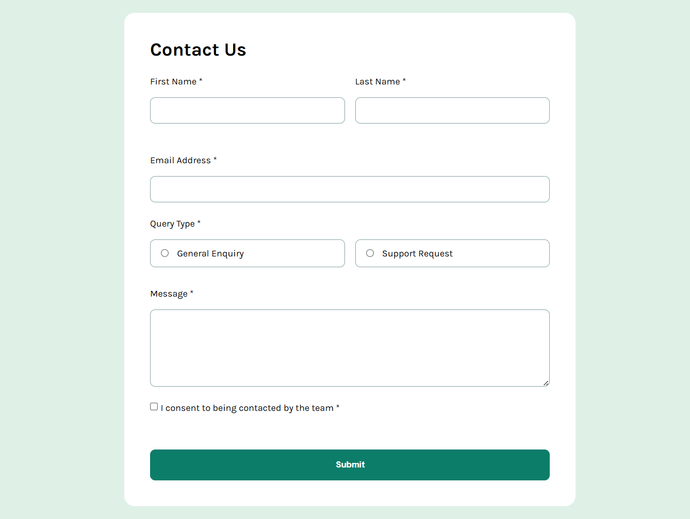

# Frontend Mentor - Contact form solution

This is a solution to the [Contact form challenge on Frontend Mentor](https://www.frontendmentor.io/challenges/contact-form-3u-6pwa7_G).

## Table of contents

- [Overview](#overview)
  - [The challenge](#the-challenge)
  - [Screenshot](#screenshot)
  - [Links](#links)
- [My process](#my-process)
  - [Built with](#built-with)
  - [What I learned](#what-learned)
- [Author](#author)

## Overview

### The challenge

Users should be able to:

- Complete the form and see a success message upon successful submission.
- Receive validation messages if:
  - A field is left empty.
  - The email address is not formatted correctly.
- Maximize accessibility by using semantic HTML and custom error states.
- View the optimal layout for the site depending on their device's screen size.
- See hover and focus states for all interactive elements on the page.

### Screenshot



### Links

- Solution URL: https://github.com/PatoCatejo/contact-form
- Live Site URL: https://patocatejo.github.io/contact-form/

## My process

### Built with

- Semantic HTML5 markup
- CSS Custom properties (Variables)
- Flexbox for layout alignment
- Mobile-first workflow
- Vanilla JavaScript for form validation

### What I learned

In this project, I focused on creating a robust client-side validation system. One of the main technical highlights was styling custom radio buttons and checkboxes using CSS while keeping the original inputs functional for accessibility.

I also practiced using the `:has()` selector in CSS to highlight the parent container of a selected radio button, providing a better visual feedback for the user.

```css
.radio-card:has(input:checked) {
  background-color: var(--green-lighter);
  border-color: var(--green-medium);
}
```

On the JavaScript side, I implemented a validation script that prevents the default form submission and checks each field against specific criteria (like Regex for emails) before showing a success toast.

```javascript
form.addEventListener("submit", (e) => {
  e.preventDefault();
  // Validation logic here...
  if (isValid) {
    showSuccess();
    form.reset();
  }
});
```

## Author

👤 **Patricio Catejo**
